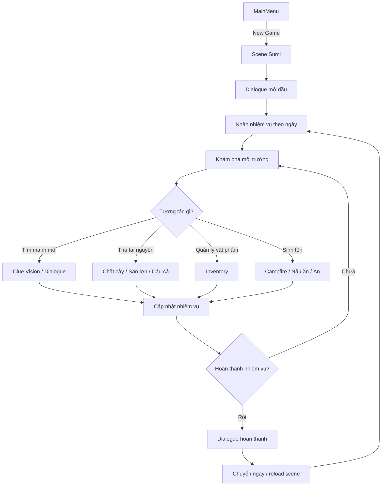
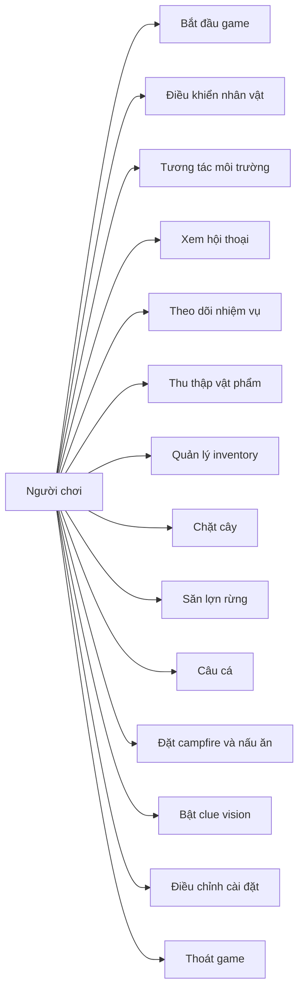
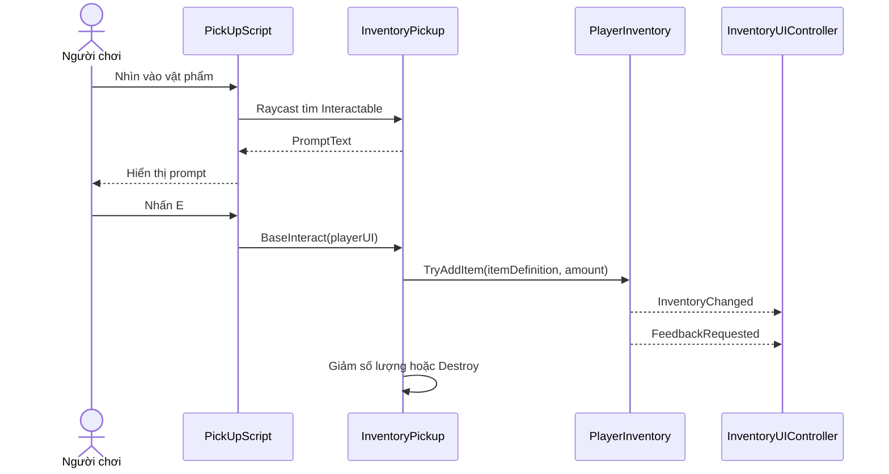
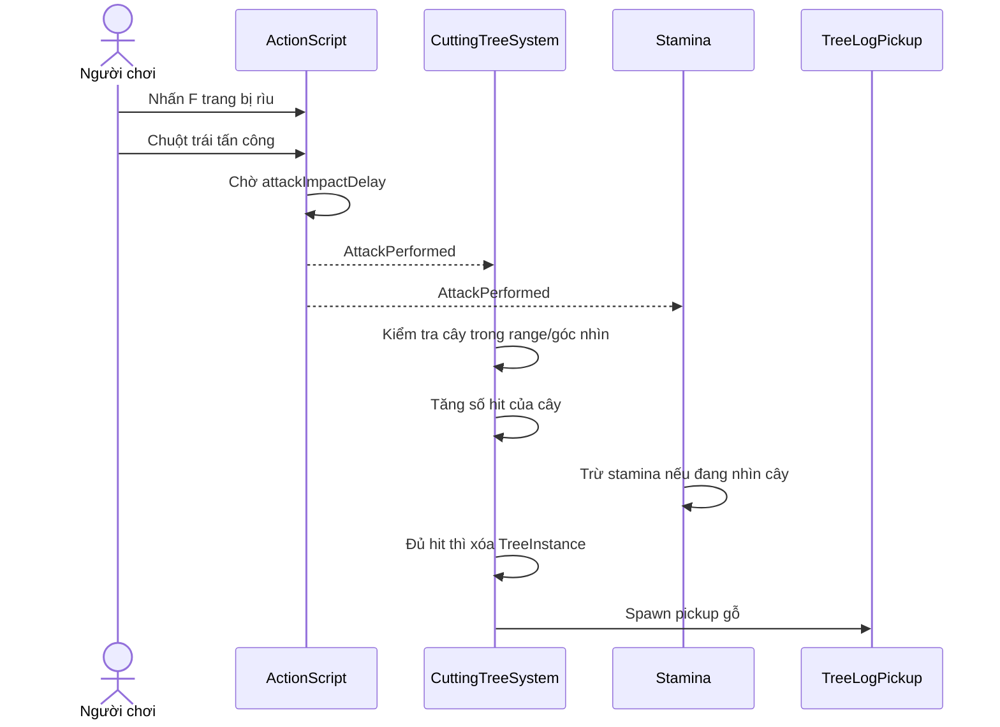
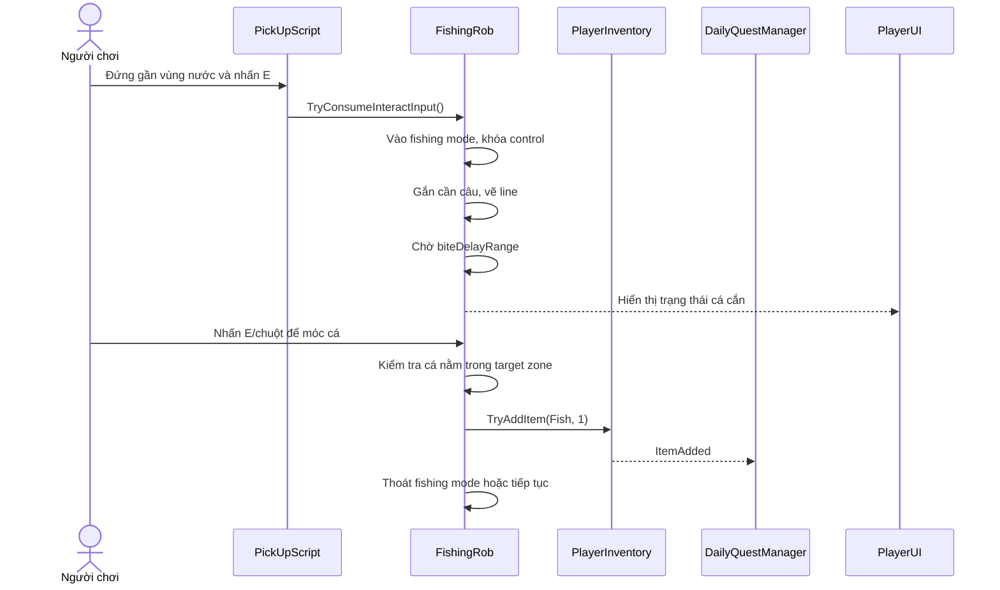
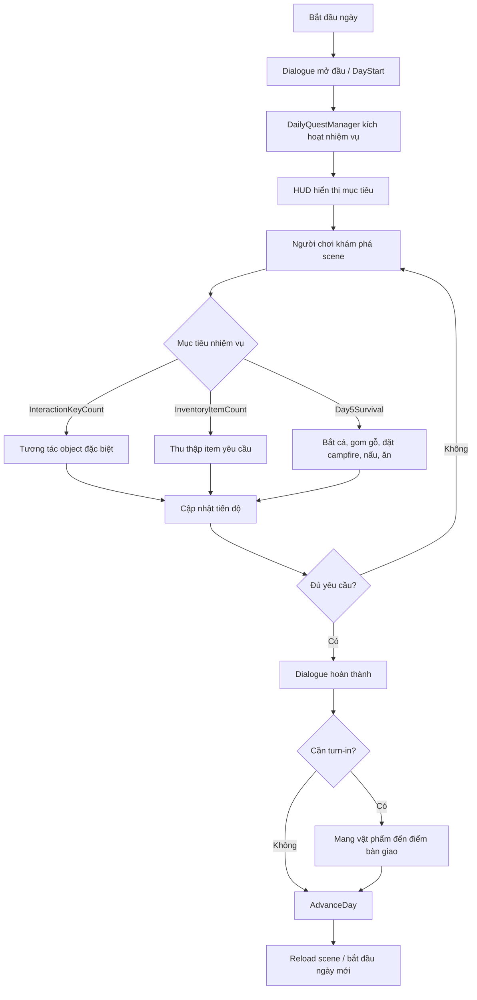
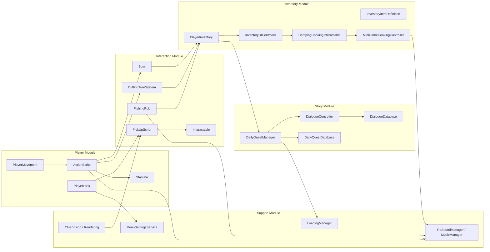
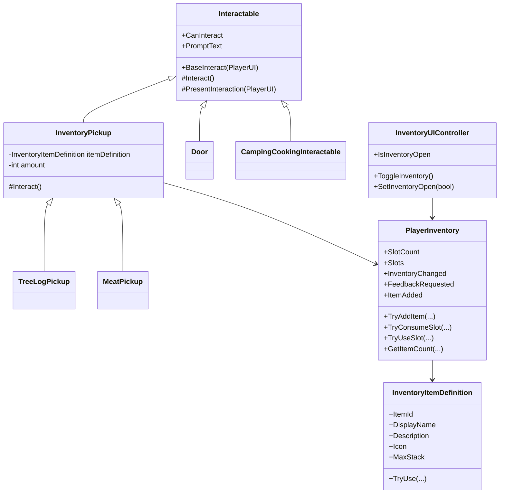
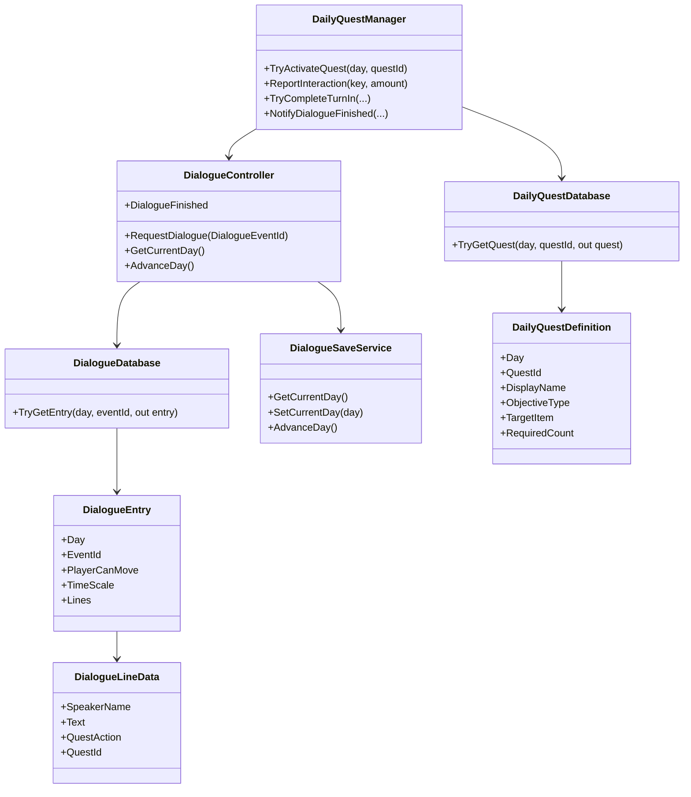

# BÁO CÁO ĐỒ ÁN TỐT NGHIỆP

## Đề tài: Xây dựng game điều tra - sinh tồn 3D trên nền tảng Unity

**Sinh viên thực hiện:** ........................................................  
**Mã sinh viên:** ........................................................  
**Lớp:** ........................................................  
**Giảng viên hướng dẫn:** ........................................................  
**Khoa:** Công nghệ thông tin  
**Trường:** ........................................................  

---

## LỜI CAM ĐOAN

Em xin cam đoan đồ án "Xây dựng game điều tra - sinh tồn 3D trên nền tảng Unity" là kết quả do em tự nghiên cứu, thiết kế và phát triển trong quá trình thực hiện đồ án. Các nội dung trình bày trong báo cáo được tổng hợp từ quá trình phân tích project Unity hiện tại, mã nguồn C#, tài nguyên scene, dữ liệu ScriptableObject và các chức năng đã được cài đặt trong game.

Những tài liệu, hình ảnh, package, model hoặc thư viện được sử dụng trong project đều được tham khảo và kế thừa trong phạm vi phục vụ học tập, nghiên cứu và phát triển sản phẩm đồ án. Các tài liệu tham khảo được liệt kê ở cuối báo cáo. Em xin chịu trách nhiệm về tính trung thực của nội dung báo cáo này.

## LỜI CẢM ƠN

Em xin gửi lời cảm ơn chân thành đến quý thầy cô trong khoa Công nghệ thông tin đã truyền đạt cho em những kiến thức nền tảng về lập trình, phân tích thiết kế hệ thống, cơ sở dữ liệu, đồ họa máy tính và quy trình phát triển phần mềm trong suốt thời gian học tập.

Đặc biệt, em xin cảm ơn giảng viên hướng dẫn đã góp ý, định hướng và hỗ trợ em trong quá trình lựa chọn đề tài, xây dựng chức năng, hoàn thiện sản phẩm game và trình bày báo cáo. Những nhận xét của thầy cô giúp em nhìn rõ hơn cách tổ chức một project Unity, cách tách module chức năng và cách đánh giá một sản phẩm phần mềm có tương tác thời gian thực.

Em cũng xin cảm ơn gia đình, bạn bè và những người đã động viên, hỗ trợ em trong quá trình thực hiện đồ án. Do thời gian và kinh nghiệm còn hạn chế, sản phẩm chắc chắn vẫn còn những điểm cần tiếp tục hoàn thiện. Em rất mong nhận được ý kiến đóng góp từ thầy cô để phát triển đề tài tốt hơn trong thời gian tới.

## MỤC LỤC

- DANH MỤC TỪ VIẾT TẮT
- DANH MỤC BẢNG BIỂU
- DANH MỤC HÌNH VẼ
- LỜI NÓI ĐẦU
- CHƯƠNG 1: TỔNG QUAN
  - 1.1. Tổng quan đề tài
  - 1.2. Khảo sát thực trạng
  - 1.3. Đề xuất phương pháp giải quyết
  - 1.4. Mô tả yêu cầu và mô hình bài toán
- CHƯƠNG 2: MỘT SỐ KIẾN THỨC CƠ BẢN THỰC HIỆN ĐỀ TÀI
  - 2.1. Ngôn ngữ lập trình C#
  - 2.2. Công cụ hỗ trợ lập trình
  - 2.3. Một số thành phần kỹ thuật nền tảng
- CHƯƠNG 3: PHÂN TÍCH VÀ THIẾT KẾ HỆ THỐNG
  - 3.1. Use Case Diagram
  - 3.2. Sequence Diagram
  - 3.3. Activity Diagram
  - 3.4. Component Diagram
  - 3.5. Class Diagram
- CHƯƠNG 4: CÀI ĐẶT, THỬ NGHIỆM VÀ ĐÁNH GIÁ
  - 4.1. Môi trường cài đặt và tổ chức project
  - 4.2. Cài đặt các module chính
  - 4.3. Thử nghiệm và đánh giá
  - 4.4. Minh họa sản phẩm thực tế
- KẾT LUẬN
- TÀI LIỆU THAM KHẢO
- PHỤ LỤC

## DANH MỤC TỪ VIẾT TẮT

| Từ viết tắt | Ý nghĩa |
| --- | --- |
| AI | Artificial Intelligence - trí tuệ nhân tạo |
| API | Application Programming Interface - giao diện lập trình ứng dụng |
| FPS | First Person Shooter/First Person - góc nhìn thứ nhất |
| HUD | Head-up Display - giao diện hiển thị trạng thái trong game |
| SFX | Sound Effects - hiệu ứng âm thanh |
| UI | User Interface - giao diện người dùng |
| UX | User Experience - trải nghiệm người dùng |
| URP | Universal Render Pipeline - pipeline render của Unity |
| TMP | TextMeshPro - hệ thống hiển thị chữ trong Unity |
| SO | ScriptableObject - đối tượng dữ liệu cấu hình trong Unity |

## DANH MỤC BẢNG BIỂU

| Ký hiệu | Tên bảng |
| --- | --- |
| Bảng 1-1 | Nội dung thực hiện trong 10 tuần |
| Bảng 1-2 | Danh sách yêu cầu chức năng chính |
| Bảng 1-3 | Danh sách yêu cầu phi chức năng |
| Bảng 2-1 | Công nghệ và package sử dụng trong project |
| Bảng 4-1 | Môi trường cài đặt |
| Bảng 4-2 | Kịch bản thử nghiệm chức năng |

## DANH MỤC HÌNH VẼ

| Ký hiệu | Tên hình |
| --- | --- |
| Hình 1-1 | Mô hình hoạt động tổng quát của game |
| Hình 3-1 | Use Case tổng quan |
| Hình 3-2 | Sequence luồng tương tác và nhặt vật phẩm |
| Hình 3-3 | Sequence luồng chặt cây |
| Hình 3-4 | Sequence luồng câu cá |
| Hình 3-5 | Activity vòng lặp gameplay theo ngày |
| Hình 3-6 | Component Diagram tổng thể |
| Hình 3-7 | Class Diagram nhóm inventory và tương tác |
| Hình 3-8 | Class Diagram nhóm hội thoại và nhiệm vụ |
| Hình 4-1 | Giao diện Main Menu |
| Hình 4-2 | Toàn cảnh scene gameplay Suml |
| Hình 4-3 | Giao diện HUD và prompt tương tác |
| Hình 4-4 | Giao diện inventory |
| Hình 4-5 | Cơ chế chặt cây và vật phẩm gỗ |
| Hình 4-6 | Lợn rừng và vật phẩm thịt |
| Hình 4-7 | Cơ chế câu cá |
| Hình 4-8 | Giao diện hội thoại |
| Hình 4-9 | HUD nhiệm vụ |
| Hình 4-10 | Mini game nấu ăn |

## LỜI NÓI ĐẦU

Trong những năm gần đây, game không chỉ là một sản phẩm giải trí mà còn là một lĩnh vực tổng hợp nhiều kiến thức của ngành công nghệ thông tin như lập trình hướng đối tượng, thiết kế hệ thống, xử lý đồ họa, xây dựng giao diện, xử lý âm thanh và tối ưu trải nghiệm người dùng. Với sự phát triển của các game engine hiện đại, sinh viên có thể tự xây dựng một sản phẩm game hoàn chỉnh ở mức đồ án, có gameplay thực tế và thể hiện được tư duy phát triển phần mềm.

Đề tài này tập trung xây dựng một game 3D góc nhìn thứ nhất trên nền tảng Unity. Người chơi vào vai nhân vật làm việc trong khu vực rừng, nhận liên lạc qua bộ đàm, thực hiện các nhiệm vụ điều tra và sinh tồn theo từng ngày. Trong quá trình chơi, người chơi có thể di chuyển, quan sát môi trường, mở cửa, tìm manh mối, phá bẫy, chặt cây, săn lợn rừng, câu cá, đặt campfire, nấu ăn, sử dụng inventory và theo dõi nhiệm vụ qua HUD.

Project hiện tại được triển khai bằng Unity `6000.0.41f1`, sử dụng ngôn ngữ C# và tổ chức mã nguồn theo các nhóm chức năng như `Player`, `Interact`, `Inventory`, `Quest`, `Dialogue`, `Menu`, `AudioManager`, `Rendering` và `Walking Boar`. Game có hai scene chính đang được bật trong Build Settings là `MainMenu` và `Suml`. Scene `MainMenu` đóng vai trò màn hình khởi động, còn scene `Suml` là màn chơi chính chứa nhân vật, môi trường rừng, nhà/cabin, nước, lợn rừng, vật phẩm, UI, dialogue, quest và các hệ thống gameplay.

Báo cáo được trình bày theo cấu trúc đồ án tốt nghiệp gồm bốn chương chính. Chương 1 trình bày tổng quan đề tài, lý do chọn đề tài, mục tiêu, phạm vi và yêu cầu hệ thống. Chương 2 trình bày cơ sở lý thuyết và công nghệ sử dụng. Chương 3 phân tích và thiết kế hệ thống bằng các sơ đồ use case, sequence, activity, component và class. Chương 4 mô tả quá trình cài đặt, thử nghiệm, đánh giá và minh họa sản phẩm thực tế.

## CHƯƠNG 1: TỔNG QUAN

### 1.1. Tổng quan đề tài

#### 1.1.1. Lý do chọn đề tài

Game 3D sinh tồn và điều tra là một thể loại phù hợp để vận dụng kiến thức đã học vào một sản phẩm cụ thể. Đề tài yêu cầu kết hợp nhiều mảng kỹ thuật: điều khiển nhân vật trong không gian 3D, camera góc nhìn thứ nhất, tương tác bằng raycast, quản lý vật phẩm, trí tuệ nhân tạo đơn giản cho sinh vật, hệ thống nhiệm vụ, hội thoại theo tiến trình, âm thanh, giao diện và lưu trạng thái bằng `PlayerPrefs`.

Unity là công cụ phù hợp cho đề tài vì hỗ trợ đầy đủ editor trực quan, hệ thống scene, prefab, component, physics, animation, UI, audio, terrain, NavMesh và ScriptableObject. Ngoài ra, Unity sử dụng C#, một ngôn ngữ hướng đối tượng rõ ràng, giúp việc tách lớp, quản lý sự kiện và cài đặt gameplay thuận tiện hơn.

Đề tài được lựa chọn nhằm xây dựng một sản phẩm game có thể chơi được, không chỉ dừng ở mô phỏng giao diện. Sản phẩm thể hiện được vòng lặp gameplay cơ bản: nhận nhiệm vụ, khám phá môi trường, tương tác với đối tượng, thu thập tài nguyên, xử lý thử thách, cập nhật tiến độ và chuyển sang mốc ngày tiếp theo.

#### 1.1.2. Mục tiêu nghiên cứu

Mục tiêu chính của đề tài là xây dựng một game 3D góc nhìn thứ nhất trên Unity với các chức năng cốt lõi sau:

- Xây dựng màn hình chính để vào game và thoát game.
- Xây dựng scene gameplay 3D có môi trường rừng, nước, nhà/cabin và các đối tượng tương tác.
- Cài đặt điều khiển nhân vật bằng bàn phím và chuột, gồm di chuyển, chạy, cúi, quan sát và khóa/mở input theo ngữ cảnh.
- Xây dựng hệ thống tương tác bằng raycast từ camera, hiển thị prompt và xử lý thao tác bằng phím `E`.
- Cài đặt cơ chế trang bị rìu bằng phím `F`, tấn công bằng chuột trái và phát sự kiện `AttackPerformed`.
- Cài đặt cơ chế chặt cây, loại bỏ cây khỏi terrain và sinh vật phẩm gỗ.
- Cài đặt lợn rừng di chuyển bằng NavMesh hoặc fallback transform movement, có máu, nhận sát thương và rơi thịt khi bị hạ.
- Cài đặt cơ chế câu cá gồm trạng thái bắt đầu, chờ cá cắn, mini game móc cá và thêm cá vào inventory.
- Xây dựng inventory có slot, stack item, icon, số lượng, thông tin vật phẩm, đặt campfire và dùng nguyên liệu để nấu ăn.
- Xây dựng hệ thống nhiệm vụ theo ngày, HUD nhiệm vụ, điều kiện hoàn thành và chuyển ngày.
- Xây dựng hệ thống hội thoại theo `DialogueDay` và `DialogueEventId`, có typewriter effect và khóa input khi cần.
- Tích hợp âm thanh cho bước chân, chạy, chặt cây, cây đổ, nhặt đồ, câu cá, nấu ăn, ăn, mở cửa và các phản hồi thắng/thua.

#### 1.1.3. Phạm vi nghiên cứu

Phạm vi của đồ án tập trung vào phiên bản game chạy trên PC trong môi trường Unity Editor hoặc bản build Windows. Đồ án không đi sâu vào multiplayer, hệ thống tài khoản trực tuyến, lưu game đầy đủ theo nhiều file save hoặc tối ưu hóa chuyên sâu cho nhiều nền tảng.

Các chức năng được đưa vào báo cáo là những chức năng đã thể hiện rõ trong project hiện tại, gồm `MainMenu`, scene `Suml`, điều khiển người chơi, tương tác, inventory, chặt cây, lợn rừng, câu cá, nấu ăn, nhiệm vụ ngày, hội thoại, clue vision, mưa theo ngày, âm thanh và cài đặt cơ bản.

Một số phần vẫn có thể phát triển thêm trong tương lai như cốt truyện ngày 6 hoàn chỉnh, hệ thống save/load toàn bộ inventory và trạng thái môi trường, hệ thống combat mở rộng, nhiều loại sinh vật hơn, nhiều vật phẩm chế tạo hơn và giao diện cài đặt thống nhất hơn.

#### 1.1.4. Nội dung thực hiện

**Bảng 1-1. Nội dung thực hiện trong 10 tuần**

| Tuần | Nội dung thực hiện | Kết quả |
| --- | --- | --- |
| Tuần 1 | Khảo sát đề tài, xác định thể loại game, lựa chọn Unity và C# | Có ý tưởng game điều tra - sinh tồn 3D |
| Tuần 2 | Thiết lập project Unity, scene, terrain, camera, nhân vật | Có scene gameplay cơ bản |
| Tuần 3 | Cài đặt điều khiển nhân vật, camera look, chạy, cúi, animation state | Nhân vật di chuyển được trong scene |
| Tuần 4 | Xây dựng raycast interaction, prompt UI, cửa và object tương tác | Người chơi tương tác được với môi trường |
| Tuần 5 | Cài đặt inventory, item definition, pickup gỗ/thịt/cá | Có túi đồ và dữ liệu vật phẩm |
| Tuần 6 | Cài đặt chặt cây, lợn rừng, stamina và âm thanh gameplay | Có vòng lặp thu thập tài nguyên |
| Tuần 7 | Cài đặt câu cá, line renderer, cá cắn câu và mini game | Có hoạt động câu cá hoàn chỉnh |
| Tuần 8 | Cài đặt dialogue, quest theo ngày, HUD nhiệm vụ và chuyển ngày | Có tiến trình nhiệm vụ theo story |
| Tuần 9 | Cài đặt clue vision, hint ngày 3, campfire, nấu ăn ngày 5 | Bổ sung yếu tố điều tra và sinh tồn |
| Tuần 10 | Kiểm thử, chỉnh sửa lỗi, rà soát báo cáo và chuẩn bị hình minh họa | Hoàn thiện bản báo cáo và sản phẩm demo |

### 1.2. Khảo sát thực trạng

#### 1.2.1. Tổng quan dòng game điều tra - sinh tồn

Các game điều tra thường tập trung vào việc quan sát môi trường, tìm manh mối, đọc thông tin và kết nối các dữ kiện để mở tiến trình cốt truyện. Các game sinh tồn lại nhấn mạnh việc quản lý tài nguyên, săn bắt, chế tạo, ăn uống, theo dõi trạng thái và thích nghi với môi trường.

Đề tài kết hợp hai hướng này ở quy mô vừa phải: người chơi không chỉ thu thập tài nguyên mà còn nhận thông tin qua hội thoại, quan sát các điểm nghi vấn, sử dụng clue vision và thực hiện nhiệm vụ theo từng ngày. Cách làm này phù hợp với đồ án vì không yêu cầu một hệ thống chiến đấu quá lớn nhưng vẫn đủ đa dạng để thể hiện nhiều kỹ thuật phát triển game.

#### 1.2.2. Phân tích một số cơ chế thường gặp

Các cơ chế thường xuất hiện trong game cùng hướng gồm:

- Góc nhìn thứ nhất để tăng cảm giác nhập vai.
- Tương tác trực tiếp với vật thể bằng raycast từ camera.
- Hội thoại hoặc radio để dẫn dắt nhiệm vụ.
- Inventory để lưu vật phẩm thu thập.
- Nhiệm vụ theo giai đoạn để định hướng người chơi.
- Hiệu ứng highlight hoặc vision mode để hỗ trợ tìm manh mối.
- Sinh vật hoặc mối nguy môi trường để tạo áp lực sinh tồn.

Project hiện tại đã triển khai được nhiều cơ chế trong số này. Cách triển khai còn ở mức đồ án, nhưng đã hình thành được một khung gameplay rõ ràng và có khả năng mở rộng.

#### 1.2.3. Đánh giá ưu điểm và hạn chế chung

Ưu điểm của hướng đề tài là dễ minh họa bằng sản phẩm thật, có thể chia nhỏ thành các module độc lập và phù hợp với cách tổ chức component trong Unity. Mỗi chức năng như player, inventory, dialogue, quest hoặc fishing có thể được phát triển, kiểm thử và trình bày riêng.

Hạn chế là game 3D dễ phát sinh nhiều vấn đề về asset, animation, collider, camera, UI, âm thanh và hiệu năng. Nếu phạm vi quá rộng, project có thể khó hoàn thiện. Vì vậy, đồ án tập trung vào các chức năng cốt lõi và tránh mở rộng sang multiplayer, thế giới mở lớn hoặc AI phức tạp.

#### 1.2.4. Hướng đi của đề tài

Hướng đi của đề tài là xây dựng một bản game demo có vòng lặp chơi rõ ràng, gồm:

1. Người chơi vào game từ Main Menu.
2. Nhân vật xuất hiện trong scene `Suml`.
3. Hệ thống hội thoại mở đầu dẫn dắt bối cảnh.
4. Người chơi nhận nhiệm vụ theo ngày.
5. Người chơi khám phá môi trường, tương tác, thu thập tài nguyên.
6. Hệ thống inventory và quest cập nhật tiến độ.
7. Khi hoàn thành mục tiêu, game chuyển sang mốc ngày tiếp theo.

### 1.3. Đề xuất phương pháp giải quyết

#### 1.3.1. Giải pháp về công nghệ và nền tảng

Đề tài sử dụng Unity `6000.0.41f1` làm nền tảng phát triển chính. Unity hỗ trợ đầy đủ các thành phần cần thiết cho game 3D như scene, prefab, GameObject, component, Animator, Rigidbody, Collider, Terrain, NavMesh, UI Canvas, TextMeshPro, AudioSource và ScriptableObject.

Ngôn ngữ lập trình chính là C#. Các chức năng được chia thành nhiều script nhỏ theo nhóm thư mục. Ví dụ, nhóm `Player` phụ trách di chuyển và hành động, nhóm `Interact` phụ trách tương tác môi trường, nhóm `Inventory` phụ trách vật phẩm và túi đồ, nhóm `Dialogue` phụ trách hội thoại, nhóm `Quest` phụ trách nhiệm vụ theo ngày.

#### 1.3.2. Giải pháp thiết kế gameplay

Gameplay được thiết kế theo hướng dễ hiểu, thao tác cơ bản:

- `W`, `A`, `S`, `D` để di chuyển.
- `Shift` để chạy.
- `Ctrl` để cúi.
- Chuột để quan sát.
- `E` để tương tác.
- `F` để trang bị hoặc cất rìu.
- Chuột trái để tấn công, đặt vật phẩm hoặc xử lý mini game theo ngữ cảnh.
- `B` để mở inventory.
- `Q` để thoát chế độ câu cá/nấu ăn hoặc bật clue vision tùy trạng thái.

Thiết kế này giúp người chơi có thể nhanh chóng nắm được cách chơi, đồng thời vẫn tạo đủ điểm tương tác để báo cáo được nhiều module kỹ thuật.

#### 1.3.3. Giải pháp kỹ thuật

Project sử dụng mô hình component của Unity. Mỗi đối tượng trong scene được gắn các component phù hợp, ví dụ:

- Player có `PlayerMovement`, `ActionScript`, `PlayerInventory`, `InventoryUIController`, `Stamina`, `FishingRob`.
- Camera có `PlayerLook`, `PickUpScript`, `CuttingTreeSystem`, `CameraEffect`.
- Vật phẩm trong scene kế thừa hoặc sử dụng `Interactable` để phản hồi khi người chơi nhìn vào và bấm `E`.
- Lợn rừng dùng `Boar`, `NavMeshAgent`, Animator và collider.
- Quest dùng `DailyQuestManager` kết hợp `DailyQuestDatabase`.
- Dialogue dùng `DialogueController` kết hợp `DialogueDatabase`.

Các dữ liệu có khả năng thay đổi như vật phẩm, nhiệm vụ và hội thoại được tách thành asset trong `Resources`, giúp giảm hard-code và thuận tiện mở rộng.

### 1.4. Mô tả yêu cầu và mô hình bài toán

#### 1.4.1. Yêu cầu chức năng

**Bảng 1-2. Danh sách yêu cầu chức năng chính**

| Mã | Chức năng | Mô tả |
| --- | --- | --- |
| F01 | Main Menu | Người chơi có thể bắt đầu game và thoát game |
| F02 | Điều khiển nhân vật | Người chơi di chuyển, chạy, cúi và quan sát trong môi trường 3D |
| F03 | Tương tác môi trường | Camera raycast phát hiện object tương tác và hiển thị prompt |
| F04 | Cửa và trigger | Người chơi có thể mở cửa, kích hoạt hội thoại hoặc cutscene |
| F05 | Trang bị rìu | Người chơi bấm `F` để trang bị/cất rìu, chuột trái để tấn công |
| F06 | Chặt cây | Cây hợp lệ bị đếm hit, bị loại khỏi terrain và sinh vật phẩm gỗ |
| F07 | Lợn rừng | Lợn rừng đi lang thang, nhận sát thương và rơi thịt khi bị hạ |
| F08 | Câu cá | Người chơi vào chế độ câu cá, chờ cá cắn và chơi mini game |
| F09 | Inventory | Lưu vật phẩm theo slot, stack, hiển thị icon, số lượng và thông tin |
| F10 | Campfire và nấu ăn | Dùng gỗ đặt campfire, đưa cá/thịt vào campfire và chơi mini game nấu ăn |
| F11 | Stamina | Thể lực giảm theo di chuyển, chặt cây, săn lợn, câu cá và hồi khi ăn |
| F12 | Dialogue | Hội thoại theo ngày/sự kiện, typewriter effect và khóa input khi cần |
| F13 | Quest | Nhiệm vụ theo ngày, HUD tiến độ, điều kiện hoàn thành và chuyển ngày |
| F14 | Clue Vision | Bật/tắt chế độ phát hiện manh mối bằng highlight và hiệu ứng camera |
| F15 | Âm thanh | Phát nhạc, SFX một lần và SFX dạng loop theo hành động |
| F16 | Cài đặt | Lưu một số thông số âm lượng, độ nhạy chuột, fullscreen và quality |

#### 1.4.2. Yêu cầu phi chức năng

**Bảng 1-3. Danh sách yêu cầu phi chức năng**

| Nhóm | Yêu cầu |
| --- | --- |
| Tính dễ dùng | Prompt cần ngắn gọn, rõ thao tác; inventory và quest HUD phải dễ đọc |
| Tính mở rộng | Module gameplay cần tách theo chức năng để thêm item, quest, dialogue mới |
| Tính ổn định | Khi mở dialogue, inventory, fishing hoặc cooking, input phải được khóa/mở đúng trạng thái |
| Tính bảo trì | Dữ liệu item, quest, dialogue nên nằm trong ScriptableObject hoặc asset cấu hình |
| Hiệu năng | Không tạo/destroy UI liên tục nếu không cần; các loop âm thanh phải được dừng đúng lúc |
| Tính nhất quán | Các phím thao tác và phản hồi âm thanh/hình ảnh phải thống nhất theo ngữ cảnh |

#### 1.4.3. Mô hình bài toán tổng quát

**Hình 1-1. Mô hình hoạt động tổng quát của game**

#### 1.4.4. Mô tả hoạt động của hệ thống

Khi người chơi bấm `NewGame` trong scene `MainMenu`, game chuyển sang scene `Suml`. Tại đây, các script khởi tạo dữ liệu, tìm reference cần thiết và chuẩn bị UI. `PlayerMovement` khởi tạo trạng thái di chuyển, `PlayerLook` khóa con trỏ và áp dụng độ nhạy chuột đã lưu, `DialogueController` tải `DialogueDatabase`, `DailyQuestManager` tải `DailyQuestDatabase`.

Trong gameplay, camera dùng `PickUpScript` để raycast về phía trước. Nếu nhìn vào object có `Interactable`, UI sẽ hiển thị prompt. Khi người chơi bấm `E`, object tương tác thực thi logic riêng như mở cửa, nhặt vật phẩm, kích hoạt dialogue, đặt gỗ, mở gói dữ liệu hoặc vào chế độ nấu ăn.

Tiến trình nhiệm vụ được điều phối bởi `DailyQuestManager`. Tùy ngày hiện tại, nhiệm vụ có thể yêu cầu đếm số lần tương tác, đếm vật phẩm trong inventory hoặc xử lý chuỗi sinh tồn ngày 5. Khi hoàn thành, hệ thống gọi hội thoại hoàn thành, tăng ngày thông qua `DialogueSaveService` và có thể reload scene bằng `LoadingManager`.

## CHƯƠNG 2: MỘT SỐ KIẾN THỨC CƠ BẢN THỰC HIỆN ĐỀ TÀI

### 2.1. Ngôn ngữ lập trình C#

#### 2.1.1. Tổng quan về C#

C# là ngôn ngữ lập trình hướng đối tượng do Microsoft phát triển, được sử dụng rộng rãi trong phát triển phần mềm desktop, web, mobile và game. Trong Unity, C# là ngôn ngữ chính để xây dựng các script điều khiển hành vi của GameObject.

C# hỗ trợ các khái niệm quan trọng như class, object, property, event, enum, interface, generic collection, coroutine và delegate. Những thành phần này rất phù hợp để tổ chức logic gameplay theo module.

#### 2.1.2. Ứng dụng C# trong đề tài

Trong project, C# được dùng để cài đặt toàn bộ logic gameplay. Mỗi script thường kế thừa `MonoBehaviour` để có thể gắn vào GameObject và tham gia vòng đời của Unity như `Awake`, `Start`, `Update`, `FixedUpdate`, `OnEnable`, `OnDisable`, `OnTriggerEnter` hoặc `OnValidate`.

Một số ví dụ trong project:

- `PlayerMovement` xử lý di chuyển bằng Rigidbody, animation state và cutscene.
- `ActionScript` xử lý trạng thái tay, trang bị rìu, đánh và phát event `AttackPerformed`.
- `PickUpScript` xử lý raycast tương tác.
- `PlayerInventory` quản lý slot, stack, thêm/xóa/dùng item.
- `InventoryUIController` xây dựng UI inventory và xử lý đặt campfire/nguyên liệu.
- `DialogueController` quản lý hàng đợi hội thoại, typewriter effect và khóa input.
- `DailyQuestManager` quản lý nhiệm vụ theo ngày và HUD tiến độ.

#### 2.1.3. Lập trình hướng đối tượng trong project

Project sử dụng lập trình hướng đối tượng ở nhiều vị trí. `Interactable` đóng vai trò lớp cơ sở cho các object có thể tương tác. Các lớp con như `Door`, `InventoryPickup`, `DialogueTrigger`, `CampingCookingInteractable`, `Day5DataCubeInteractable`, `GatherWoodTurnInInteractable` ghi đè hành vi `Interact()` hoặc các thuộc tính như `CanInteract`, `PromptText`.

Hệ thống inventory sử dụng `InventoryItemDefinition` làm lớp dữ liệu vật phẩm, kết hợp `PlayerInventory.InventorySlot` để lưu item và số lượng. Cách tổ chức này giúp cùng một logic inventory có thể làm việc với nhiều loại vật phẩm khác nhau như gỗ, thịt, cá.

Hệ thống dialogue dùng các lớp dữ liệu `DialogueEntry`, `DialogueLineData`, `DialogueDatabase`, kết hợp enum `DialogueDay` và `DialogueEventId`. Cách tách này giúp mỗi đoạn hội thoại được xác định bằng cặp ngày - sự kiện thay vì hard-code trực tiếp trong script gameplay.

#### 2.1.4. Coroutine, Event và xử lý thời gian thực

Game hoạt động theo thời gian thực nên nhiều hành động cần diễn ra theo chuỗi thời gian. Project sử dụng coroutine cho các tình huống như:

- Chờ animation tấn công rồi mới phát event hit trong `ActionScript`.
- Chạy cutscene, khóa input và đổi camera trong `PlayerMovement`.
- Hiển thị dialogue typewriter trong `DialogueController`.
- Chờ cá cắn, mở mini game và đóng UI câu cá trong `FishingRob`.
- Fade loading overlay trong `LoadingManager`.
- Đóng mini game nấu ăn sau khi hiển thị kết quả trong `MiniGameCookingController`.

Event cũng được sử dụng để giảm phụ thuộc trực tiếp giữa các module. Ví dụ, `ActionScript` phát `AttackPerformed`, sau đó `CuttingTreeSystem`, `Boar` và `Stamina` cùng nghe event này để xử lý chặt cây, gây sát thương lên lợn rừng và trừ stamina. `PlayerInventory` phát `InventoryChanged`, `FeedbackRequested`, `ItemAdded` để UI và quest cập nhật.

### 2.2. Công cụ hỗ trợ lập trình

#### 2.2.1. Unity Engine

Unity là engine chính của project. Project đang dùng Unity `6000.0.41f1`. Các scene, prefab, model, texture, material, animation, UI, audio và script đều được tổ chức trong thư mục `Assets`.

Unity cung cấp các hệ thống quan trọng được dùng trong đề tài:

- Scene Management để chuyển giữa `MainMenu` và `Suml`.
- Physics để raycast, trigger, collider và xử lý Rigidbody.
- Terrain để dựng môi trường rừng và cây.
- NavMesh để hỗ trợ lợn rừng đi lang thang.
- Animator để điều khiển animation nhân vật, tay, rìu, câu cá và lợn rừng.
- UI Canvas, UGUI và TextMeshPro để hiển thị prompt, inventory, quest HUD, dialogue và mini game.
- AudioSource để phát nhạc và hiệu ứng âm thanh.
- ScriptableObject để cấu hình item, quest và dialogue.

#### 2.2.2. Visual Studio và môi trường lập trình C#

Visual Studio hoặc IDE tương thích được sử dụng để viết, kiểm tra và chỉnh sửa mã C#. Unity tự tạo các file `.csproj` giúp IDE nhận diện class, namespace, package và API của Unity.

Trong quá trình phát triển, việc tách script theo thư mục giúp quản lý mã nguồn rõ ràng hơn. Các nhóm script chính trong project gồm:

- `Assets/scripts/Player`
- `Assets/scripts/Interact`
- `Assets/scripts/Inventory`
- `Assets/scripts/Quest`
- `Assets/scripts/Dialogue`
- `Assets/scripts/Menu`
- `Assets/scripts/AudioManager`
- `Assets/scripts/Rendering`
- `Assets/scripts/Walking Boar`

#### 2.2.3. Công nghệ và package sử dụng

**Bảng 2-1. Công nghệ và package sử dụng trong project**

| Thành phần | Vai trò |
| --- | --- |
| Unity 6000.0.41f1 | Nền tảng phát triển game |
| C# | Ngôn ngữ lập trình gameplay |
| Universal Render Pipeline 17.0.4 | Render pipeline cho scene 3D |
| TextMeshPro | Hiển thị chữ trong UI |
| Unity UI/UGUI | Button, Slider, Canvas, Image, panel |
| Unity AI Navigation 2.0.6 | Hỗ trợ NavMesh cho lợn rừng |
| Cinemachine 2.10.3 | Hỗ trợ camera nếu cần mở rộng |
| Timeline 1.8.7 | Hỗ trợ cutscene/animation sequence |
| DOTween | Fade overlay loading |
| Shader Graph | Tạo shader/hiệu ứng hình ảnh |
| Terrain Tools/Worldbuilding | Hỗ trợ dựng môi trường tự nhiên |

### 2.3. Một số thành phần kỹ thuật nền tảng

#### 2.3.1. GameObject và Component

Trong Unity, GameObject là đơn vị cơ bản của scene. Mỗi GameObject có thể gắn nhiều component để tạo ra hành vi. Ví dụ, nhân vật player có các component về chuyển động, animation, inventory, stamina và hành động tay. Camera có component nhìn, raycast tương tác và hiệu ứng clue vision.

Mô hình component giúp project dễ mở rộng. Khi cần thêm chức năng cho một object, chỉ cần gắn thêm script hoặc component tương ứng mà không cần viết lại toàn bộ class.

#### 2.3.2. ScriptableObject trong quản lý cấu hình

Project sử dụng ScriptableObject cho các dữ liệu cần chỉnh trong editor:

- `InventoryItemDefinition` cho vật phẩm như `Fish`, `Meat`, `WoodLog`.
- `DialogueDatabase` cho danh sách đoạn hội thoại theo ngày và sự kiện.
- `DailyQuestDatabase` cho danh sách nhiệm vụ theo ngày.

Cách tổ chức này giúp dữ liệu tách khỏi logic xử lý. Khi muốn thêm vật phẩm hoặc nhiệm vụ mới, người phát triển có thể thêm asset hoặc chỉnh database thay vì sửa nhiều script.

#### 2.3.3. Raycast và Collider trong tương tác

Hệ thống tương tác sử dụng raycast từ camera. Khi raycast chạm vào object có `Interactable`, prompt được hiển thị. Khi người chơi bấm `E`, object xử lý logic riêng.

Raycast cũng được dùng trong chặt cây, săn lợn và đặt campfire. Với chặt cây, camera kiểm tra cây trong terrain theo khoảng cách và góc ngắm. Với lợn rừng, ray từ giữa màn hình được kiểm tra với bounds/collider của lợn. Với đặt campfire, ray từ vị trí chuột xuống mặt đất để xác định điểm đặt hợp lệ.

#### 2.3.4. PlayerPrefs trong lưu trạng thái đơn giản

Project dùng `PlayerPrefs` để lưu một số trạng thái nhẹ:

- Ngày hiện tại của dialogue qua `dialogue.currentDay`.
- Cài đặt âm lượng, độ nhạy chuột, fullscreen và quality.
- Trạng thái một số sự kiện nhiệm vụ như gói dữ liệu ngày 5, bó gỗ ngày 3.

`PlayerPrefs` phù hợp với dữ liệu nhỏ và dễ dùng trong đồ án. Tuy nhiên, nếu mở rộng game thành sản phẩm lớn hơn, cần một hệ thống save/load riêng cho inventory, vị trí nhân vật, trạng thái scene và tiến trình nhiệm vụ.

## CHƯƠNG 3: PHÂN TÍCH VÀ THIẾT KẾ HỆ THỐNG

### 3.1. Use Case Diagram

#### 3.1.1. Use Case tổng quan

Tác nhân chính của hệ thống là người chơi. Người chơi thao tác qua bàn phím và chuột để điều khiển nhân vật, tương tác với môi trường, quản lý vật phẩm và hoàn thành nhiệm vụ.

**Hình 3-1. Use Case tổng quan**

#### 3.1.2. Use Case chi tiết

Use case "Thu thập tài nguyên" gồm ba nhánh chính. Người chơi có thể chặt cây để lấy `WoodLog`, săn lợn rừng để lấy `Meat`, hoặc câu cá để lấy `Fish`. Cả ba loại vật phẩm đều được thêm vào `PlayerInventory`, sau đó UI inventory cập nhật thông qua event `InventoryChanged`.

Use case "Hoàn thành nhiệm vụ" phụ thuộc vào `DailyQuestManager`. Tùy loại objective, hệ thống có thể đếm interaction key, đếm số lượng item trong inventory hoặc kiểm tra chuỗi sinh tồn ngày 5. Khi đạt yêu cầu, hệ thống gọi dialogue hoàn thành và chuyển ngày.

### 3.2. Sequence Diagram

#### 3.2.1. Luồng tương tác và nhặt vật phẩm

**Hình 3-2. Sequence luồng tương tác và nhặt vật phẩm**

#### 3.2.2. Luồng chặt cây

**Hình 3-3. Sequence luồng chặt cây**

#### 3.2.3. Luồng câu cá

**Hình 3-4. Sequence luồng câu cá**

#### 3.2.4. Luồng hội thoại và nhiệm vụ

Hệ thống hội thoại không hard-code trực tiếp nội dung trong script. Script gameplay chỉ gọi `DialogueController.RequestDialogue(eventId)`. Controller tự lấy ngày hiện tại từ `DialogueSaveService`, tìm entry trong `DialogueDatabase`, hiển thị từng dòng và thông báo hoàn thành qua event `DialogueFinished`. `DailyQuestManager` nghe sự kiện này để kích hoạt hoặc hoàn tất nhiệm vụ.

### 3.3. Activity Diagram

**Hình 3-5. Activity vòng lặp gameplay theo ngày**

### 3.4. Component Diagram

**Hình 3-6. Component Diagram tổng thể**

### 3.5. Class Diagram

#### 3.5.1. Nhóm inventory và tương tác

**Hình 3-7. Class Diagram nhóm inventory và tương tác**

#### 3.5.2. Nhóm hội thoại và nhiệm vụ

**Hình 3-8. Class Diagram nhóm hội thoại và nhiệm vụ**

#### 3.5.3. Nhóm player, sinh vật và tài nguyên

Nhóm player gồm `PlayerMovement`, `PlayerLook`, `MouseMovement`, `Crouch`, `ActionScript` và `Stamina`. `PlayerMovement` xử lý vận tốc Rigidbody, trạng thái chạy, animation di chuyển và một số cutscene. `PlayerLook` xử lý xoay camera và thân nhân vật theo chuột, đồng thời đọc độ nhạy chuột từ `MenuSettingsService`. `ActionScript` quản lý trạng thái tay, rìu và phát event tấn công. `Stamina` trừ thể lực theo di chuyển và hành động.

Nhóm tài nguyên gồm `CuttingTreeSystem`, `Boar`, `FishingRob`, `InventoryPickup`, `TreeLogPickup`, `MeatPickup`. Các module này không trực tiếp chỉnh UI inventory mà thông qua `PlayerInventory`, giúp dữ liệu vật phẩm được quản lý tập trung.

## CHƯƠNG 4: CÀI ĐẶT, THỬ NGHIỆM VÀ ĐÁNH GIÁ

### 4.1. Môi trường cài đặt và tổ chức project

**Bảng 4-1. Môi trường cài đặt**

| Thành phần | Giá trị |
| --- | --- |
| Game engine | Unity 6000.0.41f1 |
| Ngôn ngữ | C# |
| Render pipeline | Universal Render Pipeline |
| Scene build chính | `Assets/Scenes/MainMenu.unity`, `Assets/Scenes/Suml.unity` |
| Hệ điều hành phát triển | Windows |
| IDE | Visual Studio hoặc IDE tương thích C# |
| Package nổi bật | URP, TextMeshPro, AI Navigation, Cinemachine, Timeline, DOTween |

Project được tổ chức theo thư mục chức năng. Mã nguồn chính nằm trong `Assets/scripts`, dữ liệu item nằm trong `Assets/Resources/Inventory`, dữ liệu quest nằm trong `Assets/Resources/Quests`, dữ liệu dialogue nằm trong `Assets/Resources/Dialogue`, scene nằm trong `Assets/Scenes`, model và prefab nằm trong `Assets/model` và các thư mục asset đi kèm.

Build Settings hiện bật hai scene:

1. `MainMenu` - scene menu chính.
2. `Suml` - scene gameplay chính.

`SampleScene` vẫn tồn tại nhưng đang bị tắt trong Build Settings, do đó không được xem là luồng chính của sản phẩm.

### 4.2. Cài đặt các module chính

#### 4.2.1. Module Main Menu và Settings

Scene `MainMenu` có các button chính như `NewGameButton`, `ExitButton` và khu vực settings. Script `MainMenu` xử lý:

- `NewGame()` chuyển sang scene `Suml`.
- `ExitGame()` thoát ứng dụng.

`SettingsManager` và `MainMenuSaveManager` hỗ trợ lưu/đọc âm lượng bằng `PlayerPrefs`. Ngoài ra, `MenuSettingsService` cung cấp một lớp cài đặt tổng quát hơn cho master volume, độ nhạy chuột, fullscreen và quality preset. `PlayerLook` đọc độ nhạy chuột thông qua service này.

#### 4.2.2. Module điều khiển người chơi

`PlayerMovement` dùng Rigidbody để di chuyển nhân vật theo input `Horizontal` và `Vertical`. Khi giữ `LeftShift`, nhân vật chạy với `runSpeed`. Script cũng cập nhật trạng thái Animator bằng tham số `MoveState`, giúp chuyển các animation idle, đi, chạy theo hướng.

`PlayerLook` xử lý camera look bằng chuột, giới hạn góc nhìn dọc từ -60 đến 90 độ, đồng thời xoay thân nhân vật theo trục ngang. Khi vào gameplay, cursor được khóa để phù hợp với góc nhìn thứ nhất.

`Crouch` cho phép nhân vật cúi bằng `LeftControl`, giảm tốc độ và thay đổi vị trí đầu/collider. `Stamina` hiển thị thể lực bằng slider, giảm theo thời gian di chuyển hoặc đứng yên, đồng thời trừ thêm khi chặt cây, săn lợn và câu cá.

#### 4.2.3. Module hành động và chặt cây

`ActionScript` điều khiển trạng thái tay của player. Khi bấm `F`, script chuyển giữa trạng thái cầm và cất rìu. Khi bấm chuột trái trong trạng thái cầm rìu, script chạy animation attack, phát âm thanh chém rìu và sau `attackImpactDelay` phát event `AttackPerformed`.

`CuttingTreeSystem` nghe event này. Khi event xảy ra, script kiểm tra camera có đang nhắm vào cây hợp lệ trên terrain hay không. Cây hợp lệ được xác định bằng khoảng cách, góc nhìn, vật cản và từ khóa prototype như `pine` hoặc `tree`. Sau số hit yêu cầu, cây bị xóa khỏi `TerrainData.treeInstances`, sau đó sinh pickup gỗ tại vị trí cây.

#### 4.2.4. Module lợn rừng

Lợn rừng sử dụng script `Boar`. Script này có các thành phần chính:

- `NavMeshAgent` để di chuyển nếu object đang ở vùng NavMesh hợp lệ.
- Fallback movement bằng transform nếu NavMesh không khả dụng.
- Vùng roam ngẫu nhiên quanh vị trí xuất phát.
- Số hit để hạ lợn rừng.
- Kiểm tra ray từ giữa camera để xác nhận đòn đánh trúng mục tiêu.
- Rơi prefab `MeatPickup` khi chết.

Khi lợn bị hạ, game phát âm thanh, trừ stamina, phát event `BoarKilled`, spawn thịt và destroy object lợn.

#### 4.2.5. Module câu cá

`FishingRob` là module có nhiều trạng thái nhất trong project. Script xác định vùng nước bằng tên object hoặc renderer bounds, kiểm tra người chơi đứng đủ gần và nhìn đúng hướng. Khi bắt đầu câu cá, script khóa các điều khiển gameplay, gắn cần câu vào tay, ẩn vật phẩm đang cầm, tạo line renderer và hiển thị UI câu cá.

Chu trình câu cá gồm:

1. Người chơi đứng gần nước và bấm `E`.
2. Hệ thống tính vị trí đứng câu và điểm thả câu.
3. Cần câu được gắn vào tay, dây câu được vẽ bằng `LineRenderer`.
4. Game chờ ngẫu nhiên trong khoảng `biteDelayRange`.
5. Khi cá cắn, UI chuyển sang mini game.
6. Người chơi canh cá nằm trong vùng mục tiêu.
7. Nếu thành công, `Fish` được thêm vào `PlayerInventory`, stamina bị trừ và âm thanh thắng phát ra.
8. Nếu thất bại, game phát âm thanh thua và cho phép thử lại.

#### 4.2.6. Module inventory và vật phẩm

`PlayerInventory` quản lý danh sách slot. Mỗi slot gồm item và số lượng. Khi thêm item, hệ thống ưu tiên cộng vào stack còn trống trước, sau đó mới dùng slot rỗng. Các item chính hiện có:

- `WoodLog` với `itemId = wood_log`, stack tối đa 20.
- `Meat` với `itemId = boar_meat`, stack tối đa 10.
- `Fish` với `itemId = river_fish`, stack tối đa 10.

`InventoryUIController` tạo UI inventory runtime nếu scene chưa có đủ object. UI gồm backdrop, panel, slot grid, title, footer và icon/số lượng từng slot. Người chơi bấm `B` để mở/tắt inventory. Khi inventory mở, các control gameplay được khóa, cursor được mở và hiệu ứng blur có thể được bật qua Volume/DepthOfField.

Chuột trái trên slot có thể dùng vật phẩm, đặt campfire nếu là gỗ, hoặc đưa nguyên liệu vào campfire nếu đang ở chế độ nấu ăn. Chuột phải hiển thị thông tin vật phẩm, mô tả và gợi ý thao tác.

#### 4.2.7. Module campfire và nấu ăn

Khi người chơi chọn gỗ trong inventory, `InventoryUIController` tạo preview campfire. Người chơi đặt campfire lên mặt đất hợp lệ bằng chuột trái. Sau khi đặt, object được gắn `CampingCookingInteractable` và hệ thống báo `DailyQuestManager.ReportInteraction("day5_campfire_placed")`.

Khi tương tác với campfire, `CampingCookingModeController` vào chế độ nấu ăn, khóa input gameplay và mở inventory. Người chơi chọn cá hoặc thịt, đưa nguyên liệu chạm vào campfire để mở `MiniGameCookingController`.

Mini game nấu ăn gồm một thanh trượt di chuyển và vùng mục tiêu. Nếu người chơi bấm chuột khi slider chạm vùng mục tiêu, kết quả thắng được hiển thị, campfire cộng số món đã nấu và quest ngày 5 cập nhật tiến độ. Sau khi có món nấu, người chơi có thể ăn để hồi stamina và báo quest đã ăn.

#### 4.2.8. Module hội thoại

`DialogueController` là trung tâm điều phối hội thoại. Controller có thể tự load `DialogueDatabase` từ `Resources/Dialogue/DialogueDatabase`. Mỗi đoạn hội thoại được xác định bằng:

- `DialogueDay`: ngày hiện tại từ Day1 đến Day6.
- `DialogueEventId`: sự kiện như `IntroWakeUp`, `DayStart`, `Water`, `BearTrap`, `InvestigationStart`, `Day5FishComplete`, `Day5QuestComplete`.

Khi một script gọi `DialogueController.RequestDialogue(eventId)`, controller lấy ngày hiện tại, tìm entry phù hợp, đưa vào hàng đợi và hiển thị từng dòng lên UI. Trong lúc dialogue chạy, controller có thể khóa movement, jump, crouch, action, look, zoom, pickup và inventory theo cấu hình. UI có speaker, body text, day badge và hiệu ứng typewriter.

#### 4.2.9. Module nhiệm vụ theo ngày

`DailyQuestManager` quản lý nhiệm vụ theo ngày dựa trên `DailyQuestDatabase`. Các nhiệm vụ hiện có trong database gồm:

- Day1: tìm và phá hủy bẫy, yêu cầu interaction key `trap`, số lượng 3.
- Day2: săn thịt lợn rừng, yêu cầu item `boar_meat`, số lượng 2.
- Day3: gom gỗ, yêu cầu item `wood_log`, số lượng 5, có bước bàn giao gỗ.
- Day4: câu thêm cá, yêu cầu item `river_fish`, số lượng 3.
- Day5: sinh tồn ngày 5, yêu cầu bắt 7 cá, gom 5 gỗ, đặt campfire, nấu 3 món và ăn 1 lần.
- Day6: nhiệm vụ cuối liên quan đến câu cá hoặc tiến trình kết thúc, hiện ở mức cấu hình cơ bản.

HUD nhiệm vụ hiển thị tên nhiệm vụ, tiến độ và hướng dẫn. Với Day5, HUD hiển thị riêng từng chỉ số: cá, gỗ, món ăn và lượt ăn.

#### 4.2.10. Module clue vision, hint và môi trường theo ngày

`EchoVision` cho phép bật chế độ clue vision bằng phím `Q`. Script tìm các object có tag `Clue`, bật trạng thái `isActive` cho `EchoObject` và gọi `CameraEffect.SetEchoMode(true)` để làm tối màn hình. `EchoObject` đổi shader sang highlight và tạo hiệu ứng phát sáng nhấp nháy.

Ngày 3 có thêm `Day3HintSequenceController` và `HintDay3Interactable`. Sau dialogue mở khóa, hint được hiển thị trong scene, có hiệu ứng glitch theo khoảng cách và khi tương tác sẽ gọi dialogue tương ứng rồi đánh dấu hoàn thành bằng `PlayerPrefs`.

`RainDayController` bật/tắt object mưa theo ngày hiện tại, giúp môi trường thay đổi theo tiến trình story.

#### 4.2.11. Module âm thanh

Project có `ReSoundManager`, `SoundLibrary`, `MusicManager` và `MusicLibrary`. `ReSoundManager` hỗ trợ phát SFX một lần bằng `PlaySound2D`, phát SFX 3D bằng `PlaySound3D` và phát loop 2D bằng `PlayLoop2D`. Các sound id chính gồm `Fishing`, `SwingAxe`, `KillBoar`, `ChopTree`, `TreeFall`, `PickUp`, `Cooking`, `Walking`, `Running`, `Win`, `Lose`, `Eat`, `OpenDoor`, `GunShot`.

Các module gameplay gọi âm thanh theo ngữ cảnh. Ví dụ, `ActionScript` phát `SwingAxe`, `CuttingTreeSystem` phát `ChopTree` và `TreeFall`, `Boar` phát `KillBoar`, `MiniGameCookingController` phát `Cooking`, `Win`, `Lose`, `CampingCookingInteractable` phát `Eat`.

### 4.3. Thử nghiệm và đánh giá

#### 4.3.1. Kịch bản thử nghiệm

**Bảng 4-2. Kịch bản thử nghiệm chức năng**

| STT | Chức năng | Cách kiểm thử | Kết quả mong đợi |
| --- | --- | --- | --- |
| 1 | Main Menu | Bấm `NewGameButton` | Game chuyển sang scene `Suml` |
| 2 | Di chuyển | Dùng `WASD`, `Shift`, `Ctrl` | Nhân vật đi, chạy, cúi và animation đổi trạng thái |
| 3 | Tương tác | Nhìn object có `Interactable`, bấm `E` | Prompt hiện đúng, object xử lý tương tác |
| 4 | Mở cửa | Nhìn cửa, bấm `E` | Cửa xoay mở/đóng, phát âm thanh, có thể gọi dialogue DayStart |
| 5 | Chặt cây | Bấm `F`, nhìn cây, đánh đủ hit | Cây bị xóa, vật phẩm gỗ xuất hiện |
| 6 | Săn lợn | Bấm `F`, đánh trúng lợn đủ hit | Lợn biến mất, rơi thịt, stamina giảm |
| 7 | Câu cá | Đứng gần nước, bấm `E`, hoàn thành mini game | Cá được thêm vào inventory |
| 8 | Inventory | Bấm `B`, nhặt nhiều item | UI hiển thị slot, icon, số lượng stack |
| 9 | Đặt campfire | Chọn gỗ trong inventory, đặt xuống đất | Campfire xuất hiện và có thể tương tác |
| 10 | Nấu ăn | Vào campfire, đưa cá/thịt vào, chơi mini game | Win/Lose hiện đúng, quest cập nhật nếu thắng |
| 11 | Dialogue | Kích hoạt event story | UI dialogue hiển thị từng dòng, khóa input đúng |
| 12 | Quest HUD | Hoàn thành điều kiện nhiệm vụ | Tiến độ tăng, dialogue hoàn thành được gọi |
| 13 | Clue Vision | Bấm `Q` khi có object tag `Clue` | Object clue phát sáng, camera tối |
| 14 | Âm thanh | Thực hiện từng hành động | SFX tương ứng được phát và loop dừng đúng lúc |

#### 4.3.2. Đánh giá kết quả đạt được

Project đã hoàn thành được một khung game 3D có thể chơi thử với nhiều hệ thống kết nối với nhau. Người chơi có thể đi từ menu vào gameplay, nhận hội thoại mở đầu, tương tác với môi trường, thu thập tài nguyên, mở inventory, hoàn thành nhiệm vụ và trải nghiệm các hoạt động như chặt cây, săn lợn, câu cá, đặt campfire và nấu ăn.

Điểm mạnh của project là các module quan trọng đã được tách tương đối rõ. Dữ liệu item, quest và dialogue không bị hard-code hoàn toàn mà được đưa vào asset trong `Resources`. Các module giao tiếp với nhau qua event hoặc API tĩnh có phạm vi rõ, ví dụ `ActionScript.AttackPerformed`, `PlayerInventory.ItemAdded`, `DailyQuestManager.ReportInteraction`, `DialogueController.RequestDialogue`.

Giao diện gameplay đã có nhiều lớp phản hồi: prompt giữa màn hình, panel tương tác, inventory, quest HUD, dialogue UI, mini game câu cá, mini game nấu ăn và loading overlay. Âm thanh cũng được gắn vào nhiều hành động chính, giúp game có phản hồi tốt hơn.

#### 4.3.3. Hạn chế

Một số hạn chế còn tồn tại:

- `MainMenu` hiện chuyển scene trực tiếp bằng `SceneManager.LoadScene("Suml")`; `LoadingManager` đã có nhưng chưa phải luồng chính của nút NewGame.
- Hệ thống save/load mới lưu một số trạng thái bằng `PlayerPrefs`, chưa lưu đầy đủ inventory, vị trí người chơi và trạng thái toàn bộ scene.
- Cốt truyện ngày 6 và ending đã có khung dữ liệu nhưng cần hoàn thiện thêm nội dung, trigger và cảnh kết thúc.
- Một số UI được tạo runtime nên thuận tiện cho demo, nhưng nếu làm sản phẩm hoàn chỉnh nên chuẩn hóa prefab UI để dễ chỉnh giao diện.
- Quest, dialogue và object scene còn phụ thuộc tên object ở một số vị trí, cần giảm phụ thuộc bằng reference hoặc cấu hình rõ hơn.
- Chưa có bộ test tự động; việc kiểm thử chủ yếu là playtest trong Unity Editor.

### 4.4. Minh họa sản phẩm thực tế

#### 4.4.1. Giao diện Main Menu

Main Menu là màn hình đầu tiên của game. Giao diện có nút bắt đầu, nút thoát và khu vực cài đặt. Khi bấm New Game, game chuyển sang scene `Suml`.

**Hình 4-1. Giao diện Main Menu**  
*(Chèn ảnh chụp scene MainMenu, thấy rõ nút New Game, Settings và Exit.)*

#### 4.4.2. Toàn cảnh scene gameplay

Scene `Suml` là màn chơi chính, gồm terrain, cây, nước, nhà/cabin, object trang trí, lợn rừng, campfire, UI và các trigger nhiệm vụ. Đây là nơi diễn ra phần lớn gameplay.

**Hình 4-2. Toàn cảnh scene gameplay Suml**  
*(Chèn ảnh Game View hoặc Scene View của scene Suml.)*

#### 4.4.3. HUD và prompt tương tác

Khi người chơi nhìn vào object có thể tương tác, prompt hiện ở giữa màn hình. Quest HUD hiển thị tên nhiệm vụ, tiến độ và hướng dẫn.

**Hình 4-3. Giao diện HUD và prompt tương tác**  
*(Chèn ảnh người chơi đang nhìn vào cửa, vật phẩm hoặc campfire.)*

#### 4.4.4. Inventory

Inventory hiển thị dạng panel với nhiều slot. Mỗi slot có icon và số lượng nếu vật phẩm có stack lớn hơn 1. Người chơi bấm chuột trái để dùng/đặt, chuột phải để xem mô tả.

**Hình 4-4. Giao diện inventory**  
*(Chèn ảnh inventory đang có gỗ, thịt và cá.)*

#### 4.4.5. Chặt cây và vật phẩm gỗ

Khi người chơi cầm rìu, nhìn vào cây hợp lệ và đánh đủ số hit, cây bị xóa khỏi terrain và pickup gỗ được sinh ra. Pickup này có thể được nhặt vào inventory.

**Hình 4-5. Cơ chế chặt cây và vật phẩm gỗ**  
*(Chèn ảnh trước/sau khi chặt cây và ảnh khúc gỗ trên mặt đất.)*

#### 4.4.6. Lợn rừng và vật phẩm thịt

Lợn rừng di chuyển trong vùng roam. Khi bị người chơi đánh trúng đủ hit, lợn bị hạ và rơi vật phẩm thịt.

**Hình 4-6. Lợn rừng và vật phẩm thịt**  
*(Chèn ảnh lợn rừng trong scene và vật phẩm thịt sau khi hạ lợn.)*

#### 4.4.7. Câu cá

Câu cá là hoạt động riêng ở gần vùng nước. Game hiển thị dây câu, trạng thái chờ cá cắn và mini game canh vùng mục tiêu để bắt cá.

**Hình 4-7. Cơ chế câu cá**  
*(Chèn ảnh chế độ câu cá và mini game khi cá cắn.)*

#### 4.4.8. Hội thoại

Dialogue UI hiển thị người nói, nội dung câu thoại và tiến trình theo ngày. Hệ thống có typewriter effect và có thể khóa input khi đoạn thoại yêu cầu.

**Hình 4-8. Giao diện hội thoại**  
*(Chèn ảnh đoạn hội thoại giữa Tuấn và Nhi hoặc tiếng bộ đàm.)*

#### 4.4.9. Nhiệm vụ theo ngày

Quest HUD hiển thị nhiệm vụ hiện tại. Với ngày 5, HUD hiển thị tiến độ cá, gỗ, món ăn và số lần ăn.

**Hình 4-9. HUD nhiệm vụ**  
*(Chèn ảnh HUD nhiệm vụ Day1, Day3 hoặc Day5.)*

#### 4.4.10. Mini game nấu ăn

Mini game nấu ăn yêu cầu người chơi bấm chuột đúng lúc slider chạm vùng mục tiêu. Nếu thắng, campfire cộng món ăn và quest ngày 5 cập nhật.

**Hình 4-10. Mini game nấu ăn**  
*(Chèn ảnh giao diện MiniGameCooking với slider, rectangle, Win/Lose.)*

## KẾT LUẬN

### Kết quả đạt được

Sau quá trình thực hiện, đồ án đã xây dựng được một game 3D góc nhìn thứ nhất trên Unity với nhiều hệ thống gameplay liên kết thành một vòng lặp cơ bản. Sản phẩm có menu, scene gameplay, điều khiển nhân vật, tương tác môi trường, inventory, chặt cây, săn lợn rừng, câu cá, campfire, nấu ăn, stamina, hội thoại, nhiệm vụ theo ngày, clue vision, âm thanh và một số cài đặt người dùng.

Về mặt kỹ thuật, project thể hiện được cách tổ chức hệ thống theo module, sử dụng C# hướng đối tượng, event, coroutine, ScriptableObject, PlayerPrefs, Animator, Rigidbody, Collider, Terrain, NavMesh, UI Canvas và audio trong Unity. Báo cáo cũng đã phân tích hệ thống bằng các sơ đồ use case, sequence, activity, component và class để làm rõ cách các module phối hợp.

### Những điểm còn hạn chế

Project vẫn còn một số điểm cần cải thiện. Hệ thống lưu tiến trình chưa đầy đủ, cốt truyện và ending chưa hoàn thiện hoàn toàn, giao diện settings còn có nhiều lớp cũ/mới, một số logic phụ thuộc tên object trong scene, và chưa có test tự động. Ngoài ra, các hình ảnh minh họa cần được chụp lại từ Unity Editor hoặc bản build để đưa vào báo cáo Word hoàn chỉnh.

### Hướng phát triển

Trong thời gian tới, đề tài có thể được phát triển theo các hướng sau:

1. Hoàn thiện nội dung ngày 6 và ending của game.
2. Xây dựng hệ thống save/load đầy đủ cho inventory, vị trí người chơi, ngày hiện tại và trạng thái môi trường.
3. Chuẩn hóa UI thành prefab để dễ chỉnh sửa và tái sử dụng.
4. Mở rộng số lượng vật phẩm, công thức nấu ăn và hoạt động sinh tồn.
5. Bổ sung thêm sinh vật, sự kiện ngẫu nhiên và tương tác môi trường.
6. Tối ưu hóa scene, collider, audio loop và runtime UI.
7. Tạo bản build Windows ổn định và thực hiện playtest với người dùng thật.

## TÀI LIỆU THAM KHẢO

[1] Unity Technologies, Unity Manual, https://docs.unity3d.com/Manual/

[2] Unity Technologies, Unity Scripting API, https://docs.unity3d.com/ScriptReference/

[3] Unity Technologies, Universal Render Pipeline Documentation, https://docs.unity3d.com/Packages/com.unity.render-pipelines.universal@latest

[4] Microsoft, C# Documentation, https://learn.microsoft.com/dotnet/csharp/

[5] Demigiant, DOTween Documentation, http://dotween.demigiant.com/documentation.php

[6] Tài liệu mẫu báo cáo đồ án tốt nghiệp và báo cáo chuyên ngành do giảng viên/sinh viên cung cấp.

## PHỤ LỤC

### Phụ lục A. Danh sách script chính

| Nhóm | Script |
| --- | --- |
| Player | `PlayerMovement.cs`, `PlayerLook.cs`, `MouseMovement.cs`, `Crouch.cs`, `ActionScript.cs` |
| Interaction | `Interactable.cs`, `PickUpScript.cs`, `PlayerUI.cs`, `Door.cs`, `CuttingTreeSystem.cs`, `InteractableOnce.cs` |
| Inventory | `PlayerInventory.cs`, `InventoryItemDefinition.cs`, `InventoryPickup.cs`, `InventoryUIController.cs`, `CampingCookingInteractable.cs`, `MiniGameCookingController.cs` |
| Dialogue | `DialogueController.cs`, `DialogueDatabase.cs`, `DialogueEntry.cs`, `DialogueLineData.cs`, `DialogueTrigger.cs`, `DialogueSaveService.cs` |
| Quest | `DailyQuestManager.cs`, `DailyQuestDatabase.cs`, `DailyQuestDefinition.cs`, `GatherWoodTurnInInteractable.cs`, `Day5DataCubeInteractable.cs` |
| Gameplay | `FishingRob.cs`, `FishingRodReferences.cs`, `Boar.cs`, `Stamina.cs`, `RainDayController.cs` |
| UI/Menu | `MainMenu.cs`, `SettingsManager.cs`, `MenuSettingsService.cs`, `InGameMenu.cs`, `LoadingManager.cs` |
| Audio | `ReSoundManager.cs`, `SoundLibrary.cs`, `MusicManager.cs`, `MusicLibrary.cs` |
| Rendering/Clue | `Clue.cs`, `ClueVision.cs`, `ClueVisionCamera.cs`, `HintDay3KinoGlitchRendererFeature.cs` |

### Phụ lục B. Danh sách ảnh cần chèn khi chuyển sang Word

| File gợi ý | Nội dung |
| --- | --- |
| `Hinh_4_1_MainMenu.png` | Giao diện Main Menu |
| `Hinh_4_2_Suml_Overview.png` | Toàn cảnh scene Suml |
| `Hinh_4_3_HUD_Prompt.png` | HUD và prompt tương tác |
| `Hinh_4_4_Inventory.png` | Inventory có gỗ, thịt, cá |
| `Hinh_4_5_Chop_Tree.png` | Chặt cây và khúc gỗ |
| `Hinh_4_6_Boar_Meat.png` | Lợn rừng và thịt rơi |
| `Hinh_4_7_Fishing.png` | UI câu cá |
| `Hinh_4_8_Dialogue.png` | UI hội thoại |
| `Hinh_4_9_QuestHUD.png` | HUD nhiệm vụ |
| `Hinh_4_10_Cooking.png` | Mini game nấu ăn |
| `Hinh_3_1_UseCase.png` | Use Case tổng quan |
| `Hinh_3_6_Component.png` | Component Diagram tổng thể |
| `Hinh_3_7_ClassInventory.png` | Class Diagram inventory/tương tác |
| `Hinh_3_8_ClassDialogueQuest.png` | Class Diagram dialogue/quest |
